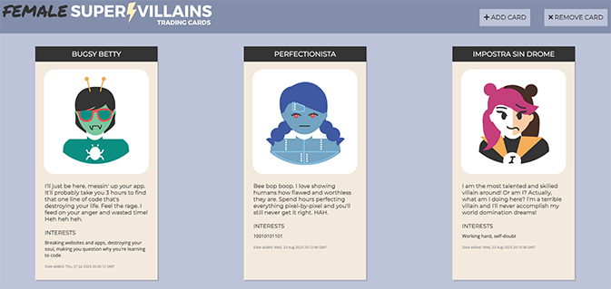

# Female Supervillain Trading Card App (REST API version)
An interactive web application that stores and displays female supervillain trading cards. The app is built with Python and Flask and uses an SQL database and a REST API. 

## About
In the Female Supervillain Trading Card app, users can:

- add female supervillain trading cards to a database.
- delete female supervillain trading cards from a database.

## Project Background
The Female Supervillain Trading Card app was built as part of Skillcrush's "Using Python to Build Web Apps" course. 

The user inputs data for a new supervillain card in an HTML form on the front end and the data is stored in an SQL database. The app is created with the Flask web framework, using SQLAlchemy and the Flask-SQLAlchemy extension to interact with the SQL database. 

The app uses a REST API and JavaScript to route and render data between the back end and front end. The jsonify function is used to convert and export data to ensure compatibility with the front end.

During this project, I practiced: 

- Working with Flask boilerplate and setting up Flask in the main.py file. 

- Setting up an SQL database using Flask-SQLAlchemy, incl. configuring the root location of the database and connecting the SQLAlchemy toolkit to the Flask app. 

- Creating a database model and building database columns to store and organize data. 

- Writing code to create an SQL database with the design specified in the database model. 

- Interacting with an SQL database, incl. querying the database and using request object methods to retrieve inputted data from an HTML form. 

- Adding REST API routing and using JavaScript files and HTTP requests to move data between the front end and back end, incl. serving HTML files, adding new supervillain cards to the database, deleting existing supervillain cards from the database, and handling error messages for the user.

- Building an API directory, indicating API endpoints, their HTTP request methods, and endpoint descriptions. 

- Adding response statuses. 

- Using jsonify to convert Python dictionary data to a JSON object. 

## Built With 
- Python
- Flask
- SQL database
- SQLAlchemy
- Flask-SQLAlchemy
- Flask jsonify
- REST API
- JavaScript
- CSS3
- HTML5

## Launch
[See the live version of the Female Supervillain Trading Card app (REST API version) here.](https://replit.com/@lonemortensen/skillcrush-py-cl02-ls10-villain-cards-restAPI-flask-final)

## Acknowledgements

**Skillcrush** - I coded the Female Supervillain Trading Card app's Python file with support and guidance from Skillcrush. The app's JavaScript, HTML, and CSS files and their contents were provided by Skillcrush.  